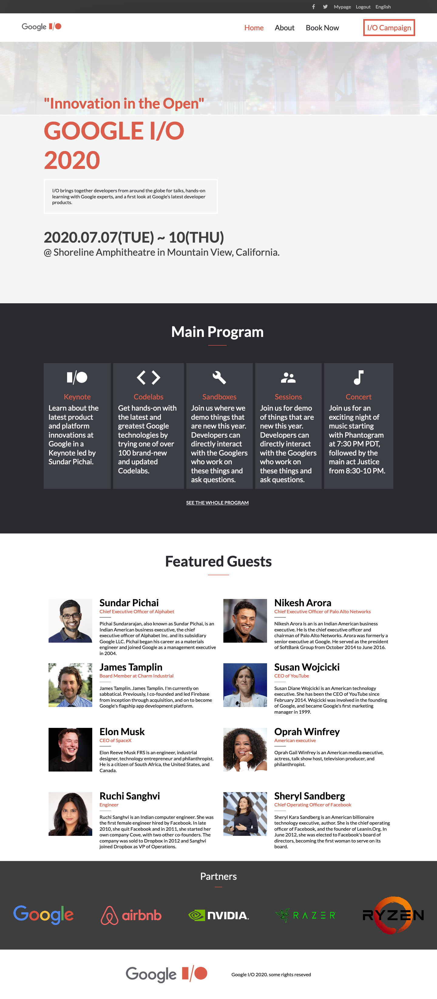

# Google I/O 2020 Website

> One paragraph statement about the project.

This is a responsive website for Google I/O event build as a part of HTML/CSS Capstone project in Microverse Curriculum. 

## Built With

- HTML, CSS
- Float, Flexbox, Grid, MediaQueries, Linear Gradients and many more.

## Live Demo

[Live Demo Link](https://livedemo.com)

## Authors

👤Ishan Chawla

- Github: [@githubhandle](https://github.com/ishanchawla1)
- Twitter: [@twitterhandle](https://twitter.com/Ishanchawla1884)
- Linkedin: [linkedin](https://www.linkedin.com/in/ishan-chawla-232988b5/)

## 🤝 Contributing

Contributions, issues and feature requests are welcome!

Feel free to check the [issues page](https://github.com/ishanchawla1/HTML_CSS_Capstone_Project/issues).

## Show your support

Give a ⭐️ if you like this project!

## Acknowledgments

### Design Templates:
- By Cyndy Shin(https://www.behance.net/adagio07)
- Font Awesome Icons(https://fontawesome.com/icons)
- Google I/O 2020(https://events.google.com/io/)

## 📝 License

This project is [MIT](lic.url) licensed.
